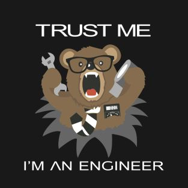

  

###

<h1 align="left">Hi there, I'm Passant!👋👋</h1>

###

🚀Know more about Passant check Portfolio:<a href=https://portfolio-qydnhjaushzlfvcqb7c2fj.streamlit.app/>Portfolio</a>

###

  

###
<h2 align="left">About me</h2>

###

✨ Former EOI'2018|Data Annotation Specialist|Passionate about Machine Learning & Computer Vision 📚 Aspiring Computer Engineer SFE'2025 🎲 Fun fact:  - I'm a GYM RAT! - I'm like a sponge in a sea of languages—I soak up every word I can!

###

<h2 align="left">I code with</h2>

###

  
  
  
  
  
  
  
  
  
  
  
  
  
  
  
  
  
  
  
  
  
  
  
  
  

###

Unshakeable Faith in "Power of Knowledge".

###

###

 

📫 Let's Connect! - LinkedIn: <a href="https://www.linkedin.com/in/passant-el-tonsy-ali-a52b42230/">PassantEltonsy</a>

passanteltonsy@gmail.com

###
